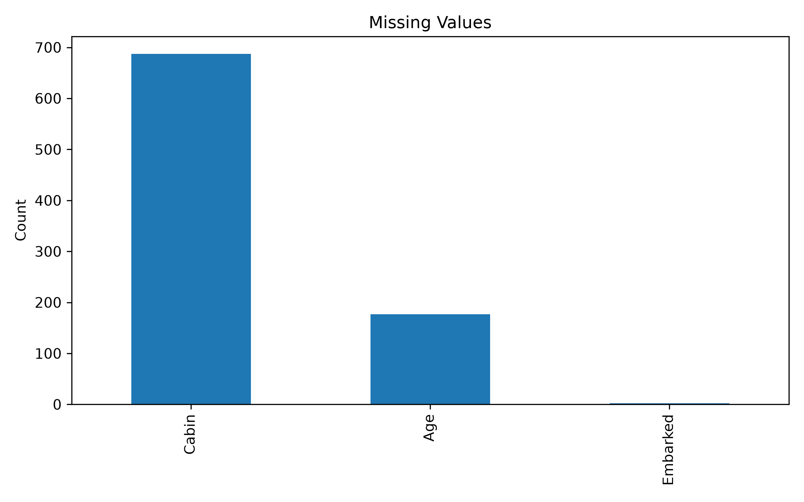
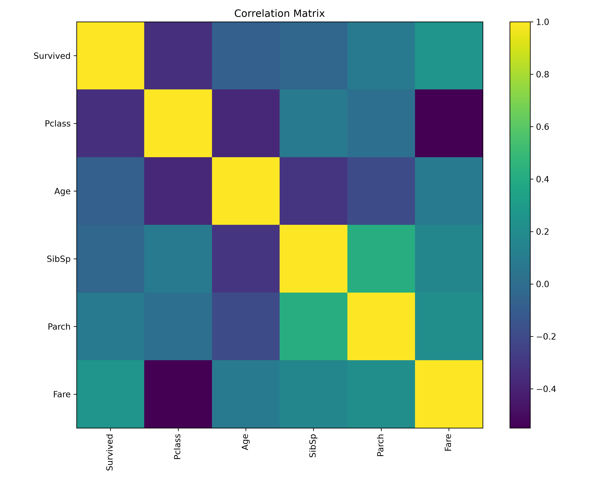
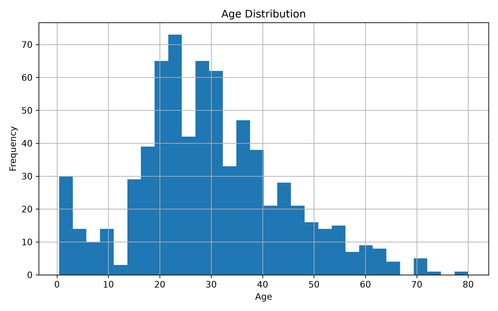
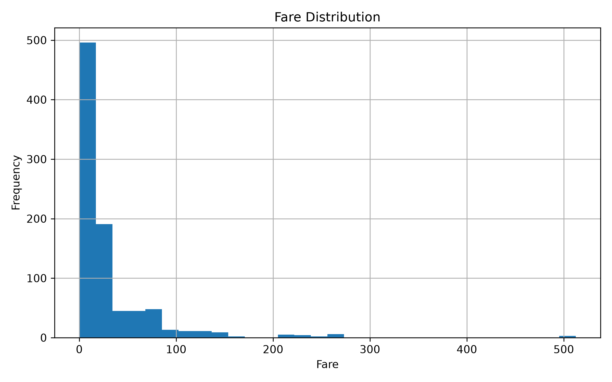
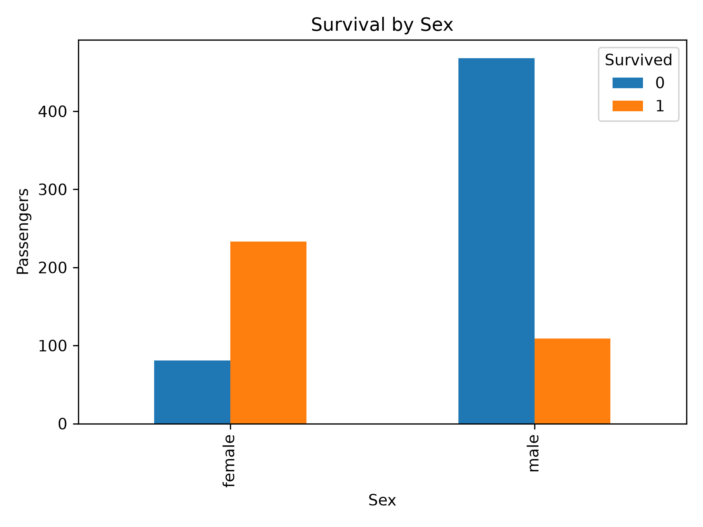
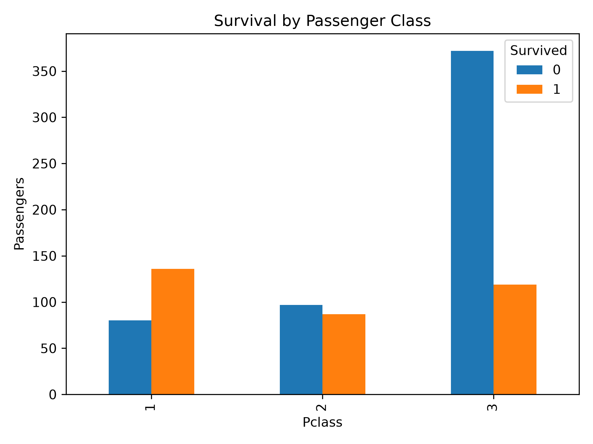

# Titanic Survival Prediction


An end-to-end machine learning project for the Kaggle Titanic competition. The project covers the complete machine learning workflow, including exploratory data analysis, feature engineering, preprocessing, model selection, ensemble learning, hyperparameter tuning, and final Kaggle submission.

---

# Table of Contents

- Project Overview
- Dataset
- Project Structure
- Exploratory Data Analysis
- Feature Engineering
- Preprocessing Pipeline
- Models
- Hyperparameter Tuning
- Results
- Installation
- Running the Project
- Future Improvements
- Conclusion

---

# Project Overview

The goal of this project is to predict whether a passenger survived the Titanic disaster using supervised machine learning.

The project was developed as a complete machine learning pipeline rather than simply training a single model. Several preprocessing techniques, feature engineering strategies, traditional machine learning models, and ensemble methods were explored before selecting the final model.

---

# Dataset

Dataset:

https://www.kaggle.com/competitions/titanic

The dataset contains passenger information such as

- Passenger Class
- Name
- Sex
- Age
- Fare
- Cabin
- Embarked
- Family Information

Target variable

- **Survived**

Training samples

- **891**

Test samples

- **418**

Task

- **Binary Classification**

---

# Project Structure

```text
Titanic/
│
├── data/
│   ├── train.csv
│   └── test.csv
│
├── figures/
│   ├── age_distribution.png
│   ├── correlation_matrix.png
│   ├── family_size_distribution.png
│   ├── fare_distribution.png
│   ├── missing_values.png
│   ├── survival_by_class.png
│   ├── survival_by_sex.png
│   └── survival_distribution.png
│
├── notebooks/
│   ├── titanic.ipynb
│   └── kaggle_submission.ipynb
│
├── src/
│   ├── feature_engineering.py
│   ├── preprocessing.py
│   ├── models.py
│   ├── evaluation.py
│   ├── predict.py
│   ├── utils.py
│   └── __init__.py
│
├── submissions/
│   ├── submission.csv
│   └── gender_submission.csv
│
├── requirements.txt
├── README.md
├── LICENSE
└── .gitignore
```

---

# Exploratory Data Analysis

Several visualizations were created to better understand the dataset before model training.

## Missing Values



---

## Correlation Matrix



---

## Age Distribution



---

## Fare Distribution



---

## Survival by Sex



---

## Survival by Passenger Class



---

# Feature Engineering

Several new features were created to improve model performance.

| Feature | Description |
|----------|-------------|
| FamilySize | Number of family members onboard |
| IsAlone | Whether the passenger traveled alone |
| Title | Passenger title extracted from the Name column |
| CabinKnown | Indicates whether cabin information exists |
| Deck | Deck extracted from Cabin |
| FarePerPerson | Fare divided by family size |
| AgeGroup | Age grouped into categories |

---

# Preprocessing Pipeline

The preprocessing pipeline was implemented using Scikit-Learn's `Pipeline` and `ColumnTransformer`.

### Numerical Features

- Median Imputation
- StandardScaler

### Categorical Features

- Most Frequent Imputation
- OneHotEncoder

The pipeline guarantees identical preprocessing during both training and inference.

---

# Models

The following machine learning models were evaluated.

### Baseline Models

- Logistic Regression
- Support Vector Classifier (SVC)
- Decision Tree

### Ensemble Models

- Random Forest
- Extra Trees
- Gradient Boosting
- XGBoost
- LightGBM
- CatBoost

Cross Validation was used to compare model performance before selecting the final model.

---

# Hyperparameter Tuning

RandomizedSearchCV and GridSearchCV were used to optimize the final CatBoost model.

## Final CatBoost Hyperparameters

| Parameter | Value |
|-----------|-------|
| Iterations | 250 |
| Depth | 4 |
| Learning Rate | 0.01 |
| L2 Leaf Regularization | 2 |
| Border Count | 16 |

---

# Results

Final selected model

**CatBoost**

## Kaggle Public Leaderboard Score

**0.78708**

---

# Installation

Clone the repository

```bash
git clone https://github.com/mustafa-al-soufi/titanic.git
```

Navigate into the project

```bash
cd titanic
```

Create a virtual environment

```bash
python -m venv .venv
```

Activate the environment

Windows

```bash
.venv\Scripts\activate
```

Linux / macOS

```bash
source .venv/bin/activate
```

Install dependencies

```bash
pip install -r requirements.txt
```

---

# Running the Project

Open the notebook

```text
notebooks/titanic.ipynb
```

or

```text
notebooks/kaggle_submission.ipynb
```

Run all notebook cells.

The final Kaggle submission will automatically be generated inside

```text
submissions/submission.csv
```

---

# Machine Learning Workflow

```
Load Data
        │
        ▼
Exploratory Data Analysis
        │
        ▼
Data Cleaning
        │
        ▼
Feature Engineering
        │
        ▼
Preprocessing Pipeline
        │
        ▼
Baseline Models
        │
        ▼
Ensemble Models
        │
        ▼
Cross Validation
        │
        ▼
Hyperparameter Tuning
        │
        ▼
Final CatBoost Model
        │
        ▼
Kaggle Submission
```

---

# Future Improvements

Possible future improvements include

- Bayesian Hyperparameter Optimization
- Model Stacking
- Feature Selection
- SHAP Explainability
- Automated Experiment Tracking using MLflow

---

# Conclusion

This project demonstrates a complete end-to-end machine learning workflow using the Kaggle Titanic dataset. Multiple preprocessing techniques, feature engineering strategies, ensemble learning methods, and hyperparameter optimization were explored before selecting CatBoost as the final model.

The project serves as a practical demonstration of modern supervised machine learning workflows using Scikit-Learn and gradient boosting algorithms while following a modular project structure suitable for larger machine learning projects.